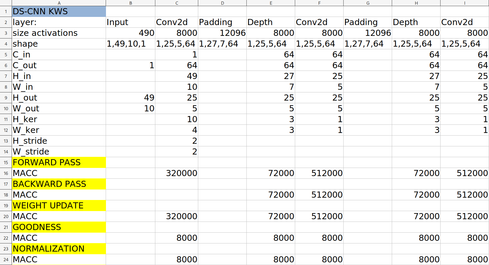

# Suitability of Forward-Forward learning to Tiny Devices
This repository contains the spreadsheet("analysis.ods") of the quantitative analysis performed for the paper "Suitability of Forward-Forward and PEPITA Learning to MLCommons-Tiny benchmarks". 


## Brief description
The objective of the analysis is to evaluate the performances in terms of memory usage and complexity of a learning procedure X on a certain model Y tackling a task T on a dataset D. of a learning procedure X on a certain model Y tackling a task T on a dataset D. The learning procedures are Backpropagation (BP), Forward-Forward (FF), PEPITA (PEP), MEMPEPITA (MPE). The models evaluated were respectively named DS-CNN, MobileNet, ResNet and AutoEncoder (AE). The datasets used were Speech Commands (SC), Visual Wake Words (VWW), Cifar10 and ToyADMOS. For more information, read the original paper.

## Methodology
### Assumptions
The following assumptions were made: 
- Weights, biases and activations are quantized to INT8. The softmax layer, present only in the CNN models, is quantized to FLOAT32. The MACCs of the softmax layer should, therefore, be FLOP32. However, as the computations for the softmax layer are negligible in the economy of considered neural netowrks, they were assumed INT8 for the sake of simplicity. 
- When calculating peak RAM it was considered considered that to calculate a new layer it is not possible to overwrite an existing layer buffer in memory, but it is necessary to allocate a new buffer (which contributes to total RAM).
- Batch normalization layers, present in the original models, were not considered.

### MACCs procedure

As first step, a closed formula to calculate the MACCs needed by a generic layer (fully-connected, convolutional, depthwise convolutional, etc) to perform a certain operation was expressed. The operations considered are forward pass, backward pass, weight update and other operations specific to Forward learning procedures, such as normalization and goodness for Forward-Forward and error projection for PEPITA. In such a way, given the charachteristics of a layer (e.g. number of channels in input, size of kernel), it is possible to rapidly and mechanically calculate the MACCs required by a specific operation. Therefore, for each layer its charachteristics were written down and for each operation the corresponding formula was applied to obtain the required MACCs.



The MACCs relative to a certain operation were summed across all layers, to obtain the MACCs required by the entire model to perform the operation. Then, the number of total MACCs for a learning procedure were calculated by summing the MACCs of the operations involved in such procedure. This was done both for training and inference.

### RAM procedure
The method for calculating the peak activations memory usage during training depending on the learning procedure used is shown in the following table.
| Learning procedure | cvations                                 |
| :------------------: | :------------------------------------------:|
| BP and PEPITA      | sum of the activations buffers of all layers |
| FF                 | maximum value of the sum of the activation buffers of two consecutive layers plus the input sample |
| MEMPEPITA          | maximum value of the sum of the activation buffers of two consecutive layers and of the largest activation buffer between these two layers |

The peak activations memory usage by the learning workload based on BP or PEPITA is equal to the sum of the activation buffers of all the NN layers; and for FF to the maximum value of the sum of the activation buffers of two consecutive layers plus the input sample as it needs to be stored to make negative data for the later negative pass. About MEMPEPITA to the maximum value of the sum of the activation buffers of two consecutive layers and of the largest activation buffer between these two layers. The RAM at inference time is the same for BP, unsupervised FF, PEPITA and MEMPEPITA, while the supervised FF adds the input activations as it requires more passes. To obtain the peak total RAM during training, it is sufficient to add to the peak activations memory the memory occupied by weights. During inference, RAM is composed by only activation buffers. 
 fdd

### Notation

the corresponding formula was applied to each layer
Applied the formula to compute, given the specifications of a layer (H_in)

Notation:
closed formulas for the number of MACCs for a generic layer (fully-connected, convolutional, depthwise convolutional, etc) during forward pass, backward pass and weight update. Other operations specific to the Forward learning procedure were also considered, such as normalization and goodness for Forward-Forward and error projection for PEPITA. Then, chosen a certain model, we calculated the MACCs of each layer to perform such operations. The MACCs required by a certain learning procedure 


Then, we applied them to each layer and obtained the total MACCs for each learning procedure starting from the MACCs of the single operations.
To compute training and inference time on a certain MCU model, the corresponding MACCs were multiplied by the cycles per MACC and divided by the frequency of the processor.


## Citation
```
@inproceedings{
  suitability,
  title={Suitability of Forward-Forward learning to Tiny Devices},
  author={Pua, Danilo and Aymone, Fabrizio},
  booktitle={Example)},
  year={2023}
} 
```
